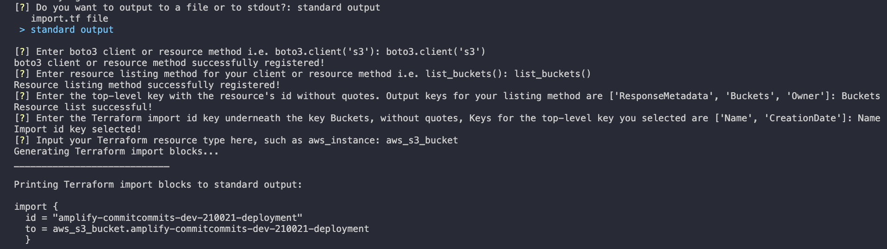

# generate-aws-tf-import-blocks

## Introduction & Goals

The development of this script was prompted by the _use case of needing to create [Terraform import blocks](https://developer.hashicorp.com/terraform/language/import) in bulk for AWS resources using the [Hashicorp AWS Terraform provider](https://registry.terraform.io/providers/hashicorp/aws/latest/docs) in order to use the exciting new Terraform feature to [generate configuration off of existing resources for import](https://developer.hashicorp.com/terraform/language/import/generating-configuration)_. This became **tedious and untenable** quickly with more and more resources needing blocks, so I started working with [boto3](https://boto3.amazonaws.com/v1/documentation/api/latest/index.html) as it is the SDK I'm most familiar with for AWS, to simplify and automate the process. My **goals** were to:

- Provide a **personal tool** for importing different resources, and then later
- To **make it more accessible** so other people could read and maybe use my silly Python code.

At first I simply had a `.py` file that I edited with the client call, method to list resources, etc., for each new resource I needed to import, which are now user inputs in this script. I probably spent more time making this more user-friendly and modular than I'll ever save with it with it being written late in its use case project for myself, but it was fun to dive into Python a little and explore some obscure-to-me code in the form of `compile()` and maybe someone else will find a use for and/or better yet develop on this.

## Technologies Used

- boto3
- [inquirer](https://github.com/magmax/python-inquirer), a neat CLI UI library for better looking input prompts.
- Terraform (implicitly, it generates terraform config.)

## How It Works

The code and requested inputs are pretty demonstrative. The script gathers the appropriate information to run calls and introspect on the correct AWS resource after a list operation on the resource, grabs the user-specified id for Terraform's purposes and loops over the listed resources creating import blocks which are output to a file.
_NOTE: I've barely tested this and only on a small subset of resources, with small API calls due to operating in my personal account_

## How To Use

**Non-Docker Use**

- [Install boto3 for Python and set up AWS authentication](https://boto3.amazonaws.com/v1/documentation/api/latest/guide/quickstart.html)
- Run `python3 app.py`

**Docker Use**
_TBD_

**Overall App Use**

- Enter the requested inputs to generate the configuration code, **preferably with boto3 docs on hand** if you're not familiar with the methods involved and the resultant dictionary to be parsed for your id.
- Use the generated file with `terraform plan -generate-config-out` to ease importing bulk resources.

## Lessons Learned / Observations

- Writing those import blocks by hand was getting pretty tiresome and I'd avoid it whenever possible going forward for any non-trivial number of resources.
- `compile()` and `eval()` are really interesting uses of Python, along with `subprocess.run()` , Python has some neat built-in ability to run code like that.
- boto3 and AWS's API, including pagination and the results schemas, will inevitably render this **useless or frustrating for some resources and use cases**. Ah well. It's something -- you can always use [Terraformer](https://github.com/GoogleCloudPlatform/terraformer) -- which I like but required a lot of fiddling with for me when I worked with it briefly -- or [Firefly](https://www.firefly.ai/) -- which is a SaaS tool that does a lot more than just easing imports and seems really neat, though I'm just now trying it out while writing this README -- or some other tool(s) in the IaC ecosystem.

## TO-DOs

- **boto3 Resource support** in addition to the client methods.
- Perform some **proper testing**.
- Provide some **examples of use**, maybe a video demo.
- Handle **pagination** for large numbers of resources -- this is a big one, AWS API limits are a Thing.
- Turn into a **full-fledged CLI app** by coding in AWS resources and their accompanying client or resource, listing method and keys. **If I had the time.**
- Implement **better error handling instead of just returning to the start of script**.

## Resources

- https://realpython.com/python-eval-function/

## License and Use

_This project is licensed under the terms of the MIT license. Developing upon it is super encouraged and awesome, I'd love to hear if anyone finds value in or improves upon this little goofy script._
